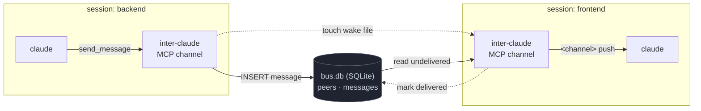

# inter-claude-channels

[](https://github.com/biswajitpatra/inter-claude-channels/actions/workflows/ci.yml)
[](LICENSE)

A peer-to-peer [channel](https://code.claude.com/docs/en/channels) that lets
Claude Code sessions talk to each other. Start two sessions, and one can message
the other — the message is **pushed straight into the recipient's running
session** as a `<channel>` event, delivered through the native channels API
rather than copy-pasting or terminal-injection hacks.




No daemon, no network, no tokens. All shared state lives in **one SQLite
database** (`bus.db`): who's online (`peers`) and every message with its
delivery status (`messages`). Sending is an `INSERT`; the recipient's server
polls for its undelivered rows, pushes them into its session, and stamps them
delivered.

## Why

Claude Code's [Agent Teams](https://code.claude.com/docs/en/agent-teams) spawn
teammates from one lead, and tools like [clauder](https://github.com/MaorBril/clauder)
bind a session's identity at launch and deliver by typing into your terminal.
`inter-claude` instead uses the native **channels** push API, so any two
independently-started sessions on your machine can exchange messages — and you
can even **rename a session while it's running** with `set_name`.

## Requirements

- [Bun](https://bun.sh)
- Claude Code **v2.1.80+** (channels are a research-preview feature)
- Same machine, same user (the bus is a local SQLite file)

## Install

```bash
git clone https://github.com/biswajitpatra/inter-claude-channels
cd inter-claude-channels
bash scripts/install.sh
```

This installs deps and registers `inter-claude` as a user-level MCP server so
it's reachable from any directory.

## Uninstall

```bash
bash scripts/uninstall.sh        # add --yes to skip the prompt
```

Removes the MCP registration, the SQLite bus (db + WAL/SHM, wake files, lock),
and the install backup. Restart any running sessions to fully drop the channel.
The cloned repo is left in place (delete it manually if you want).

## Use

Channels are opt-in per session. In one terminal:

```bash
INTER_CLAUDE_NAME=frontend claude --dangerously-load-development-channels server:inter-claude
```

In another:

```bash
INTER_CLAUDE_NAME=backend  claude --dangerously-load-development-channels server:inter-claude
```

Now ask `frontend`: *"list_peers, then send_message to backend asking what the API contract is."*
`backend` receives it mid-session as a `<channel source="inter-claude" from="frontend">` event and can reply with `send_message` back to `frontend`.

See [`examples/two-sessions.md`](examples/two-sessions.md) for a full walkthrough.

## Tools

| Tool | Args | Description |
|------|------|-------------|
| `send_message` | `to`, `text` | Message one peer by name |
| `broadcast` | `text` | Message every other online peer |
| `list_peers` | — | Sessions currently online |
| `whoami` | — | This session's name |
| `set_name` | `name` | Rename this session live |

Incoming messages arrive as:

```
<channel source="inter-claude" from="frontend" msg_id="42" ts="...">
what's the API contract?
</channel>
```

To reply, call `send_message` with `to` set to the `from` value.

## How it works

- **Discovery** — each session upserts a row in `peers` and refreshes `last_seen`
  every 15s. A peer silent for 45s is treated as offline and reaped.
- **Delivery** — `send_message` does an `INSERT` into `messages` (`delivered_at`
  NULL) and **touches the recipient's wake file**. The recipient `fs.watch`es
  that file and drains the instant it changes: it reads its undelivered rows,
  pushes each into its session via the channels API, then sets `delivered_at`
  (so a row is marked delivered **only after** a successful push — never lost,
  never double-counted). A 3 s poll runs as a safety net.
- **Audit** — `delivered_at IS NULL` is pending, a timestamp means delivered
  ("gone"). `bash scripts/doctor.sh` shows pending/delivered counts per peer.
- **Offline mailbox** — a row sits undelivered until the recipient is online, so
  you can message a peer that hasn't started yet; it drains on launch.

Why a wake file? SQLite can't notify other processes
([`update_hook` is same-process only](https://sqlite.org/c3ref/update_hook.html)),
so cross-session delivery needs an external trigger. A per-peer wake file watched
with `fs.watch` (backed by `kqueue`/`inotify`) gives event-driven, near-instant
push with no daemon, no network, and none of the PID-signal hazards of `SIGUSR1`.
The wake file carries no data — it's purely a "go look at the DB" nudge — and the
3 s poll covers the rare missed filesystem event.

## Data & migrations

The schema is defined with [Drizzle ORM](https://orm.drizzle.team) in
[`db/schema.ts`](db/schema.ts); all queries go through the small repository in
[`db/index.ts`](db/index.ts). Versioned migrations live in `drizzle/` and are
**applied automatically on startup**. To evolve the schema later:

```bash
# edit db/schema.ts, then:
bun run db:generate     # writes a new drizzle/NNNN_*.sql migration
```

Ship it — the next session start applies any pending migration.

Inspect the bus directly (it's just SQLite):

```bash
sqlite3 ~/.claude/channels/inter-claude/bus.db \
  "SELECT sender, recipient, body, delivered_at FROM messages ORDER BY id DESC LIMIT 10;"
```

## Security

A channel message is injected into Claude's context, which is a prompt-injection
surface. `inter-claude` is scoped to **one machine, one user**: the bus is a
SQLite file under your home directory and peers are other local sessions you
started. It listens on **no network port**. Don't point `INTER_CLAUDE_HOME` at a
shared or world-writable location, and be deliberate about combining it with
`--dangerously-skip-permissions`. See [SECURITY.md](SECURITY.md).

## Project layout

```
server.ts                  the channel (MCP server: tools + delivery loop)
db/schema.ts               Drizzle table definitions
db/index.ts                the bus: SQLite client + migrations + queries
drizzle/                   generated, versioned SQL migrations
drizzle.config.ts          drizzle-kit config
.mcp.json                  MCP registration (plugin form)
.claude-plugin/plugin.json plugin manifest
scripts/install.sh         register + print launch command
scripts/uninstall.sh       remove registration + bus
scripts/doctor.sh          diagnose runtime, registration, peers, mailboxes
scripts/demo.ts            self-driving demo (records the README cast)
examples/two-sessions.md   end-to-end walkthrough
test/bus.test.ts           integration tests over real stdio processes
```

## Prior art

[clauder](https://github.com/MaorBril/clauder) pioneered cross-session messaging
for Claude Code, also backed by a shared SQLite store. `inter-claude` keeps that
idea but delivers through the native channels API instead of terminal injection,
and adds live rename and delivery tracking.

## License

MIT — see [LICENSE](LICENSE).
