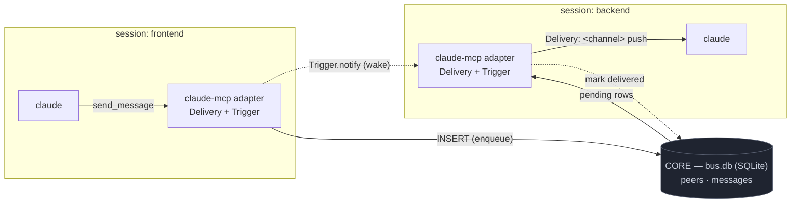

# agentbus

[](https://github.com/biswajitpatra/agentbus/actions/workflows/ci.yml)
[](LICENSE)

A **local message bus for AI agent sessions**. Start two Claude Code sessions and
one can message the other — the message is **pushed straight into the
recipient's running session** as a `<channel>` event, through the native
[channels](https://code.claude.com/docs/en/channels) API. No copy-paste, no
terminal-injection hacks, no daemon, no network.


agentbus is built as a tiny **core + pluggable adapters** (ports & adapters), so
the same bus can reach other runtimes later. Today it ships one adapter —
**Claude Code over MCP** — and defines the standard the next ones implement. See
**[SPEC.md](SPEC.md)**.



All shared state lives in **one SQLite database** (`bus.db`): who's online
(`peers`) and every message with its delivery status (`messages`). Sending is an
`INSERT`; the recipient's adapter drains its undelivered rows, pushes them into
its session, and stamps them delivered.

## Architecture

Three pieces, cleanly separated (full contracts in [SPEC.md](SPEC.md)):

- **core/** — the runtime-agnostic bus: presence, a durable mailbox, delivery
  tracking. Knows nothing about MCP or how a message reaches a session.
- Two **ports**: `Trigger` (PULL — how a recipient is woken) and `Delivery`
  (PUSH — how a message enters a live session).
- **adapters/** — a *module* per runtime that implements both ports plus a
  `module.json`. Ships: `claude-mcp` (Trigger = file-watch, Delivery = MCP
  channel). Future: Gemini, Codex, or an A2A edge — without touching the core.

Why not just use A2A? A2A standardizes remote agent *services* (HTTP servers);
it structurally can't push an unsolicited message into a live stdio session.
agentbus does that last mile and keeps its envelope A2A-shaped so a remote leg
can be bolted on as an adapter. (Details in [SPEC.md §9](SPEC.md).)

## Requirements

- [Bun](https://bun.sh)
- Claude Code **v2.1.80+** (channels are a research-preview feature)
- Same machine, same user (the bus is a local SQLite file)

## Install

```bash
git clone https://github.com/biswajitpatra/agentbus
cd agentbus
bash scripts/install.sh
```

This installs deps and enables the `claude-mcp` module (registers it as a
user-level MCP server, reachable from any directory).

Manage modules anytime:

```bash
bun run agentbus list        # modules and whether each is enabled
bun run agentbus enable claude-mcp
bun run agentbus disable claude-mcp
bun run agentbus doctor      # runtime, registration, live peers, mailboxes
```

## Uninstall

```bash
bun run uninstall            # disable every module + remove the bus
```

Removes the MCP registration, the SQLite bus (db + WAL/SHM, wake files, lock).
Restart any running session to fully drop the loaded channel. The cloned repo is
left in place.

## Use

Channels are opt-in per session. In one terminal:

```bash
AGENTBUS_NAME=frontend claude --dangerously-load-development-channels server:agentbus
```

In another:

```bash
AGENTBUS_NAME=backend  claude --dangerously-load-development-channels server:agentbus
```

Now ask `frontend`: *"list_peers, then send_message to backend asking what the API contract is."*
`backend` receives it mid-session as a `<channel source="agentbus" from="frontend">` event and can reply with `send_message`.

See [`examples/two-sessions.md`](examples/two-sessions.md) for a full walkthrough.

## Tools

| Tool | Args | Description |
|------|------|-------------|
| `send_message` | `to`, `text` | Message one peer by name |
| `broadcast` | `text` | Message every other online peer |
| `list_peers` | — | Sessions currently online |
| `whoami` | — | This session's name |
| `set_name` | `name` | Rename this session live |

Incoming messages arrive as:

```
<channel source="agentbus" from="frontend" msg_id="42" ts="...">
what's the API contract?
</channel>
```

To reply, call `send_message` with `to` set to the `from` value.

## How it works

- **Discovery** — each session upserts a row in `peers` and refreshes `last_seen`
  every 15s. A peer silent for 45s is treated as offline and reaped.
- **Delivery** — `send_message` does an `INSERT` into `messages` (`delivered_at`
  NULL) and fires `Trigger.notify`. The recipient's adapter drains its
  undelivered rows, pushes each via the `Delivery` port, then sets `delivered_at`
  (so a row is marked delivered **only after** a successful push — at-least-once,
  never silently lost). A 3 s poll runs as a safety net.
- **Offline mailbox** — a row sits undelivered until the recipient is online, so
  you can message a peer that hasn't started yet; it drains on launch.
- **Audit** — `delivered_at IS NULL` is pending, a timestamp means delivered.
  `bun run agentbus doctor` shows pending/delivered counts per peer.

**Triggers are pluggable.** The default `file-watch` Trigger touches a per-peer
wake file and `fs.watch`es it (`kqueue`/`inotify`) for near-instant, daemon-free
push — SQLite can't notify other processes
([`update_hook` is same-process only](https://sqlite.org/c3ref/update_hook.html)),
so cross-session delivery needs an external nudge. Set `AGENTBUS_TRIGGER=poll` to
swap in the interval Trigger where filesystem events don't work.

## Data & migrations

The schema is defined with [Drizzle ORM](https://orm.drizzle.team) in
[`core/schema.ts`](core/schema.ts); all queries go through the small bus in
[`core/bus.ts`](core/bus.ts). Versioned migrations live in `drizzle/` and are
**applied automatically on startup**. To evolve the schema later:

```bash
# edit core/schema.ts, then:
bun run db:generate     # writes a new drizzle/NNNN_*.sql migration — commit it
```

Inspect the bus directly (it's just SQLite):

```bash
sqlite3 ~/.agentbus/bus.db \
  "SELECT sender, recipient, body, delivered_at FROM messages ORDER BY id DESC LIMIT 10;"
```

## Security

A channel message is injected into the agent's context, which is a
prompt-injection surface. agentbus is scoped to **one machine, one user**: the
bus is a SQLite file under your home directory and peers are other local sessions
you started. It listens on **no network port**. Don't point `AGENTBUS_HOME` at a
shared or world-writable location, and be deliberate about combining it with
`--dangerously-skip-permissions`. See [SECURITY.md](SECURITY.md).

## Project layout

```
core/schema.ts             Drizzle table definitions (peers, messages)
core/bus.ts                the bus: SQLite client + migrations + queries
core/ports.ts              the standard: Envelope, Trigger, Delivery contracts
core/paths.ts              where the bus lives (~/.agentbus)
triggers/file-watch.ts     wake-file Trigger (default, event-driven)
triggers/poll.ts           interval Trigger (fallback)
adapters/claude-mcp/       the Claude Code module: MCP server + module.json
drizzle/                   generated, versioned SQL migrations
cli.ts                     module manager (list/enable/disable/doctor/uninstall)
scripts/install.sh         bootstrap: deps + enable claude-mcp
scripts/demo.ts            self-driving demo (records the README cast)
examples/two-sessions.md   end-to-end walkthrough
test/bus.test.ts           integration tests over real stdio processes
SPEC.md                    the agentbus standard
```

## Prior art

[clauder](https://github.com/MaorBril/clauder) pioneered cross-session messaging
for Claude Code over a shared SQLite store, and
[session-bridge](https://blog.shreyaspatil.dev/session-bridge-i-made-two-claude-code-sessions-talk-to-each-other/)
does it with a file mailbox. agentbus keeps the local-SQLite idea but delivers through the
native channels API, adds live rename and delivery tracking, and factors the
transport into pluggable ports so other runtimes can join.

## License

MIT — see [LICENSE](LICENSE).
